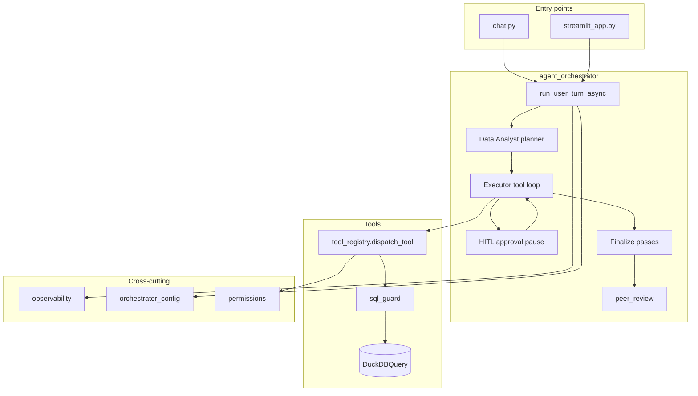

# Architecture

This document describes how the **healthcare analytics agent** is structured: entry points, the async agent loop, tools, guardrails, session state, observability, and exports. Implementation files live at the repo root and under `tools/`.

## High-level flow

- **Entry points** (`chat.py`, `streamlit_app.py`) build an `AsyncOpenAI` client, hold the **message list**, **`SessionState`**, and **`SessionLog`**, and call **`run_user_turn_async`** per user message. They contain no tool or SQL logic.
- **`run_user_turn_async`** ([`agent_orchestrator.py`](agent_orchestrator.py)) is the single implementation used by both UIs. A sync **`run_user_turn`** also exists for parity but is not used by the entry points.

## Per-turn pipeline

Each user message runs through these phases (optional steps controlled by [`orchestrator_config.py`](orchestrator_config.py) / env vars):

1. **Planner** — Data Analyst agent returns JSON (`plan_markdown`, `prioritize_visualization`). If empty, legacy `PLANNER_SYSTEM` fallback. Skipped when `DISABLE_PLANNER=1`.
2. **Executor** — OpenAI tool-calling loop: assistant completion → `dispatch_tool` → tool messages → repeat until text-only answer.
3. **HITL** (optional) — If `ENABLE_QUERY_APPROVAL` and SQL `LIMIT` ≥ threshold, return early with `approval_checkpoint`; resume via `resume_user_turn_after_approval_async` after UI or terminal approval.
4. **Finalize** (post-executor, when there is a final answer):
   - Chart narrative (LLM, uses `sample_rows` from chart tool)
   - Report Writer (rewrite for clarity)
   - Follow-up ranking (top 3 bullets from ~6 candidates)
   - Peer review (evidence check; optional `PEER_REVIEW_MODEL`; non-`pass` verdict prepends notice to answer)

## Planner

- **Primary:** `_run_data_analyst_agent` / `_async_run_data_analyst_agent` with `ANALYST_SYSTEM` — structured JSON plan + viz hints.
- **Fallback:** `PLANNER_SYSTEM` completion if `plan_markdown` is empty.
- **Disable:** `DISABLE_PLANNER=1` or Streamlit “Disable planner”.
- Plan is appended as an assistant message so the executor sees it.

## Executor

- **Model / tools:** `CHAT_MODEL` (default `gpt-4o`); tools filtered by role via [`tools/permissions.py`](tools/permissions.py).
- **Limits:** Max **28** tool rounds per turn; max **2** failed `query_database` calls per turn (`retry_limit_reached` in code).
- **Concurrency:** Tool calls in one round run in parallel via `asyncio.gather`, except when HITL is enabled (sequential + approval gate).
- **Context:** [`tools/context_manager.py`](tools/context_manager.py) prunes old turns when estimated tokens exceed ~80% of limit; preserves **session digest** (cohort SQL, recent tables) in the summary message.
- **Streaming:** Streamlit passes `stream_delta` / `stream_reset` into `_async_streaming_chat_completion`.

## Tool registry

- **Schemas:** `OPENAI_TOOLS` in [`tools/tool_registry.py`](tools/tool_registry.py):
  - `list_tables`, `query_database`, `summarize_sql_stats`, `describe_table`, `table_info`, `profile_table`, `create_chart`, `data_quality_check`, `analyze_care_gap`
- **Dispatch:** `dispatch_tool` → `_dispatch_tool_impl` is the only execution path. Wrapped with **`trace_span("tool.dispatch")`** and **`log_tool_result`** ([`observability.py`](observability.py)).
- **SQL:** All SQL tools use **`query_with_columns_timed`** from [`tools/sql_guard.py`](tools/sql_guard.py).
- **RBAC:** Unknown tools return `unknown_tool` before role checks. Viewer role restricts tools and table names.
- **Cache:** In-memory TTL (~5 min) for identical `query_database` / `summarize_sql_stats` SQL; charts are not cached.

## SQL guard

[`tools/sql_guard.py`](tools/sql_guard.py):

- **Read-only:** Only `SELECT` / `WITH` / schema helpers; rejects `INSERT`, `DELETE`, `DROP`, etc.
- **LIMIT policy:** `SELECT ... FROM ...` must include `LIMIT n` (validated before run).
- **Server cap:** `prepare_sql_for_execution` caps LIMIT to `SQL_SERVER_MAX_LIMIT` (default 10000) even if the model requests more.
- **Timeout:** Wall-clock interrupt on DuckDB connection.
- **Errors:** Structured JSON via [`tools/sql_error_hints.py`](tools/sql_error_hints.py) (`error_kind`, `next_step`).

## Session state

[`tools/session_state.py`](tools/session_state.py):

- Rolling context: latest user request, last SQL, **cohort SQL** (“same cohort”), recent tables, chart paths.
- **HITL:** `approved_sql_keys` — normalized SQL hashes approved for the session (no re-prompt).
- Injected into system prompt via `build_system_content` → `context_block()`.
- Not persisted across process restarts.

## Session log and exports

[`session_log.py`](session_log.py):

- Per turn: user, planner, tool rounds (name, args, results), assistant, peer review.
- `to_markdown()` / `save()` → `outputs/reports/session_<timestamp>.md` (executive summary, reproducibility metadata, digest).
- Terminal: `export` command; Streamlit: sidebar download.

## Peer review

[`peer_review.py`](peer_review.py):

- Second no-tools completion against truncated tool evidence + final answer.
- Markdown sections: **Verdict**, **Checks**, **Risks**, **Suggestions**.
- `parse_peer_review_verdict` → `pass` | `review_needed` | `concerns` | `unknown`.
- Non-`pass` verdicts: `apply_peer_review_notice` prepends a warning to the primary answer; Streamlit shows an additional banner.

## Human-in-the-loop (HITL)

[`tools/approval_policy.py`](tools/approval_policy.py):

- When `ENABLE_QUERY_APPROVAL=1` and SQL `LIMIT` ≥ `QUERY_APPROVAL_MIN_LIMIT` (default 1000), orchestrator pauses before dispatching the tool round.
- `ApprovalCheckpoint` stores state for `resume_user_turn_after_approval_async(approved=True|False)`.
- Reject returns `approval_denied` tool JSON so the model can recover.

## Observability

[`observability.py`](observability.py):

- **`trace_id`** per process, **`turn_id`** per user message.
- **`trace_span(name)`** — nested spans with `span.start` / `span.ok` / `span.fail` and `duration_ms`.
- **`log_tool_result`** — parses tool JSON, logs `error_kind` on failure.
- Configure via `LOG_LEVEL`, `LOG_FORMAT` (`text`|`json`), `LOG_TO_FILE` → `outputs/logs/agent.log`.

Key log `event` values: `turn.start`, `turn.end`, `turn.exception`, `executor.tool_round`, `tool.result`, `sql.execute`, `hitl.pause`, `hitl.resume`, `peer_review.done`.

## Configuration

[`orchestrator_config.py`](orchestrator_config.py) resolves flags from env each turn. See [`env.template`](env.template) for the full list (`DISABLE_*`, `CHAT_MODEL`, `PEER_REVIEW_MODEL`, SQL and HITL vars).

## Related docs

- **[README.md](README.md)** — setup, usage, configuration table, tests.
- **[examples/README.md](examples/README.md)** — SQL and demo narratives.
- **`tools/db_query.py`** — DuckDB wrapper; `healthcare.duckdb` load path.
